# Recipe Finder

## Overview

The Recipe Finder is a web application that allows users to search for recipes, view details, and save their favorite recipes. The application is built using React, TypeScript, and SCSS for styling.

## Features

- **Search for Recipes**: Users can search for recipes by entering keywords or ingredients.
- **View Recipe Details**: Users can click on a recipe to view detailed information, including ingredients, instructions, and preparation time.
- **Save Favorite Recipes**: Users can save their favorite recipes by clicking the heart icon, which toggles between filled and empty states.
- **Responsive Design**: The application is designed to work well on both mobile and desktop devices.

## Setup and Run

To set up and run the application, follow these steps:

1. **Clone the Repository**:

   ```bash
   git clone https://github.com/ewelinaszoda/recipe-finder.git
   cd recipe-finder
   ```

2. **Install Dependencies**:
   Make sure you have Node.js installed. Then run:

   ```bash
   npm install
   ```

3. **Run the Application**:
   Start the development server:

   ```bash
   npm start
   ```

   The application will be available at `http://localhost:3000`.

4. **Run Tests**:
   To run tests, use:
   ```bash
   npm test
   ```
   - use RTL to test the app, create only one test as example

## Tools and Libraries Used

- **React**: A JavaScript library for building user interfaces.
- **TypeScript**: A typed superset of JavaScript that compiles to plain JavaScript.
- **SCSS**: A preprocessor scripting language that is interpreted or compiled into CSS.
- **React Testing Library**: A library for testing React components.

## Error Handling

The application includes basic error handling for API requests. If a user performs a search that fails (e.g., due to network issues or an invalid query), an error message will be logged to the console. Users are encouraged to check their internet connection and try again. Future improvements could include displaying user-friendly error messages directly in the UI.

## Assumptions and Design Decisions

1. **User Experience**: The application is designed to be user-friendly and responsive, ensuring a good experience on both mobile and desktop devices.
2. **API Usage**: The application fetches recipes from the Dummy JSON API (`https://dummyjson.com/recipes`). The API is used to retrieve a list of recipes and search for specific recipes based on user input.
3. **State Management**: The application uses React's built-in state management to handle the list of recipes and the user's favorite recipes.
4. **Responsive Design**: The layout is designed to adapt to different screen sizes, with specific styles for mobile and desktop views.
5. **Accessibility**: Basic accessibility practices are followed, such as using semantic HTML and ensuring that interactive elements are keyboard accessible.

## Screenshots

Desktop view

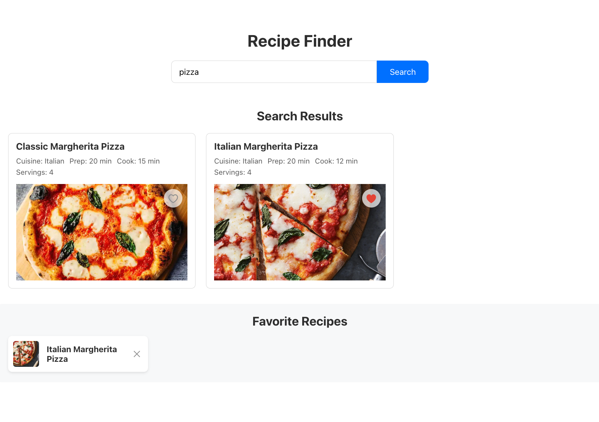

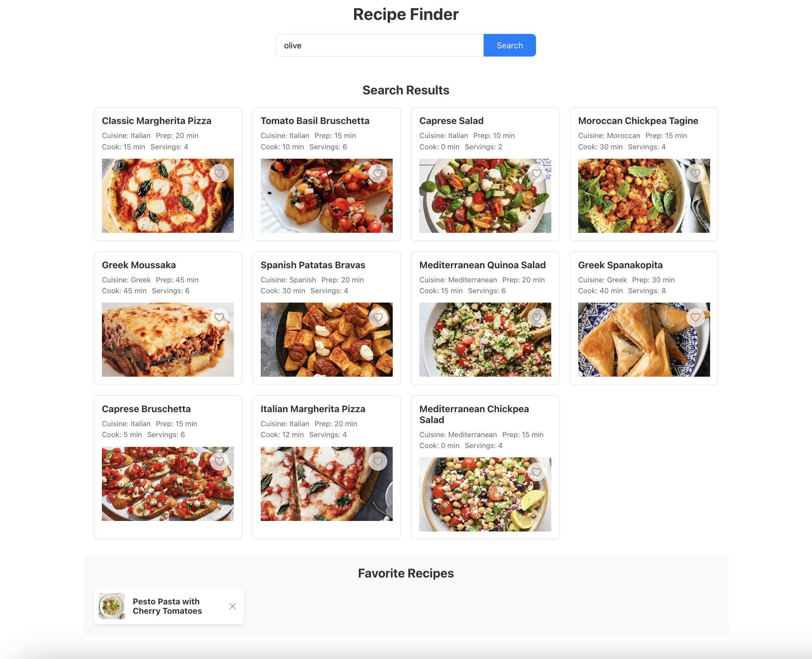

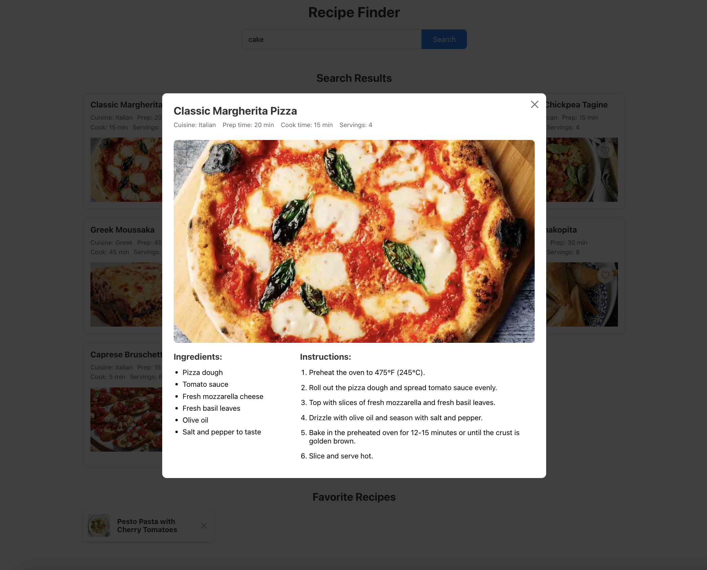

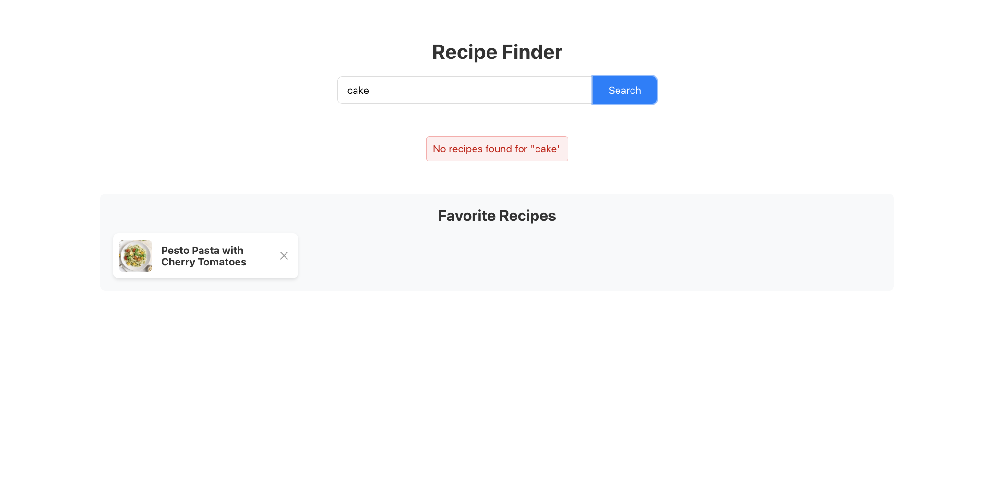

Mobile view

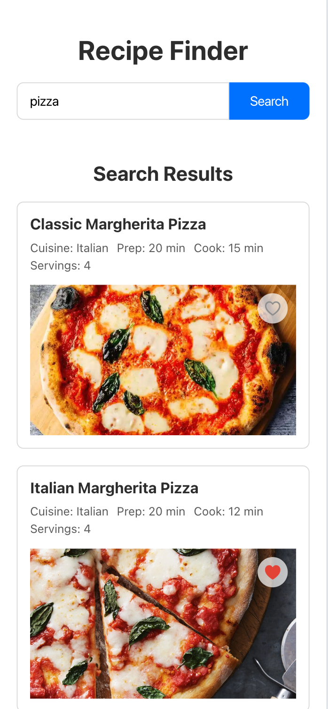
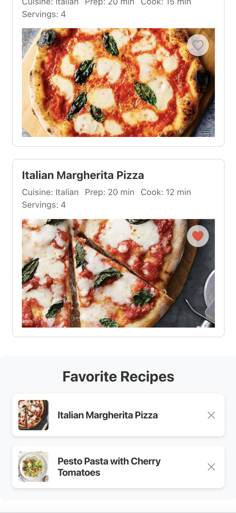

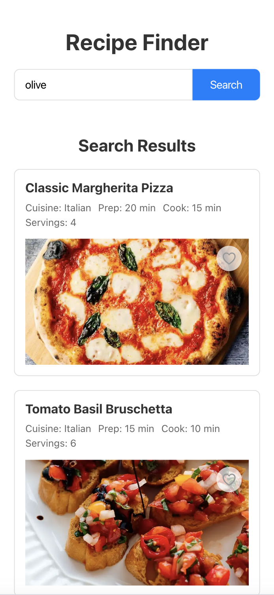
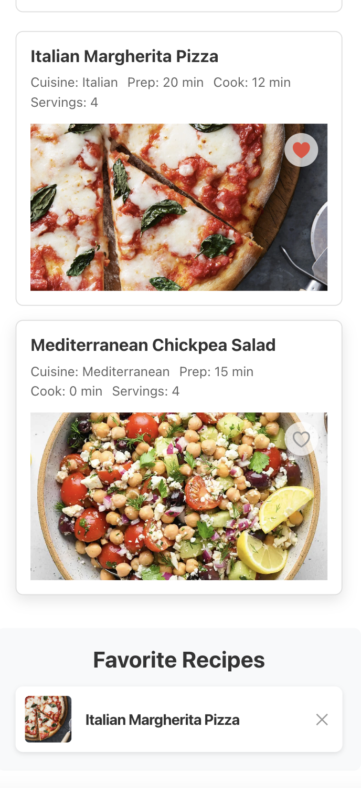

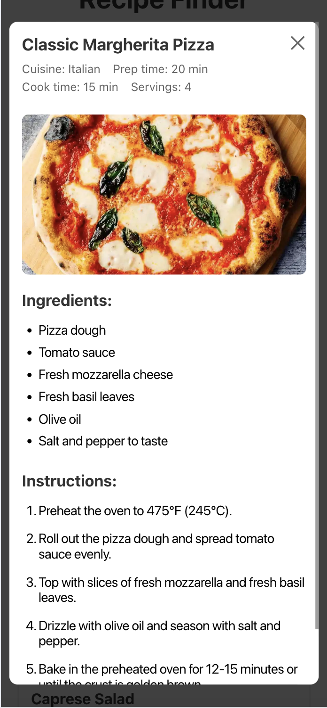
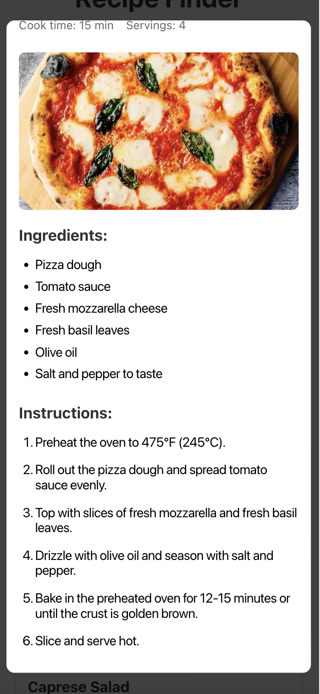

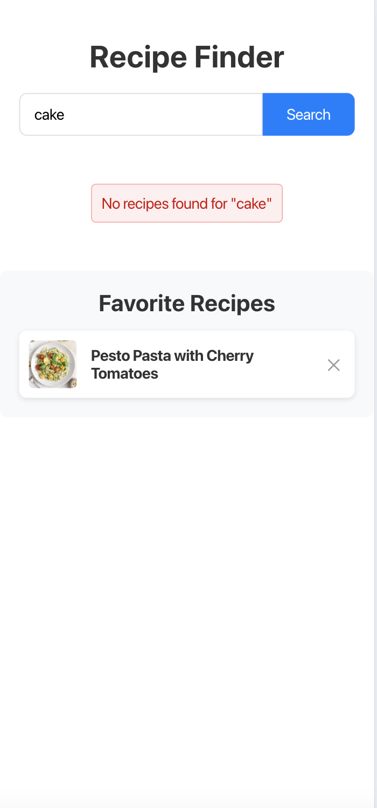

## License

This project is licensed under the MIT License - see the [LICENSE](LICENSE) file for details.
